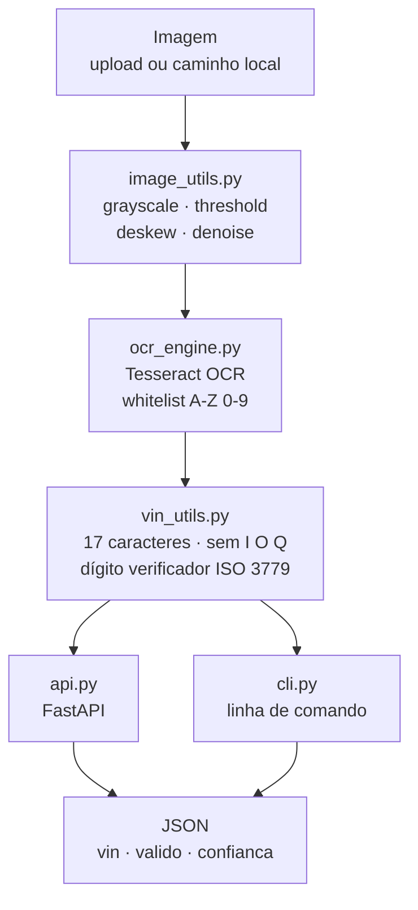

<div align="center">

# 🔎 ChassiScan

**Leitura automatizada de números de chassi (VIN) a partir de imagens, com validação conforme a norma ISO 3779.**


[](https://www.python.org)
[](https://fastapi.tiangolo.com)
[](https://www.docker.com)
[](https://www.terraform.io)
[](https://docs.astral.sh/ruff/)
[](https://github.com/psf/black)
[](https://github.com/EdsonOliveira18/chassiscan/releases)

</div>

---

## 📌 Sobre o projeto

A conferência manual do número de chassi em pátios, vistorias e seguradoras é
lenta, repetitiva e sujeita a erro humano — um único caractere trocado invalida
o registro. O **ChassiScan** automatiza esse processo: recebe uma imagem,
extrai o **VIN** via OCR, valida o código e devolve o resultado por
**API REST** ou **CLI**.

> ### 🎯 Fase 1 — Configuração e Automação Inicial
> Esta entrega estabelece a **base de engenharia** do projeto: versionamento
> disciplinado, containerização, infraestrutura como código, testes
> automatizados e pipeline de integração contínua.

---

## 🧱 Stack

| Camada | Tecnologia |
| :--- | :--- |
| Linguagem | Python 3.12 |
| API | FastAPI + Uvicorn |
| OCR | Tesseract OCR |
| Processamento de imagem | OpenCV / Pillow |
| Testes | Pytest + pytest-cov |
| Qualidade de código | Ruff + Black |
| Container | Docker (multi-stage) + Docker Compose |
| Infraestrutura | Terraform (AWS) |
| CI | GitHub Actions |

---

## 📂 Estrutura do projeto

```text
chassiscan/
├── .github/
│   ├── workflows/ci.yml            # pipeline de integração contínua
│   └── pull_request_template.md    # checklist padrão de PR
├── app/
│   ├── __init__.py
│   ├── api.py                      # rotas FastAPI
│   ├── cli.py                      # interface de linha de comando
│   ├── config.py                   # configuração via variáveis de ambiente
│   ├── image_utils.py              # pré-processamento da imagem
│   ├── ocr_engine.py               # integração com o Tesseract
│   └── vin_utils.py                # normalização e validação do VIN
├── tests/
│   ├── conftest.py                 # fixtures compartilhadas
│   ├── test_unit_vin.py            # marcador: unit
│   ├── test_integration_api.py     # marcador: integration
│   └── test_accuracy.py            # marcador: accuracy
├── infra/
│   ├── backend.tf                  # state remoto (S3) + lock (DynamoDB)
│   ├── providers.tf                # provider AWS + default_tags
│   ├── main.tf                     # recursos da infraestrutura
│   ├── variables.tf                # variáveis tipadas
│   ├── outputs.tf                  # saídas do módulo
│   └── envs/
│       ├── dev.tfvars
│       └── prod.tfvars
├── Dockerfile
├── docker-compose.yml
├── requirements.txt
├── pyproject.toml
├── .gitignore
└── README.md
```

---

## 🔄 Arquitetura



---

## ⚙️ Pré-requisitos

- Python **3.12+**
- **Tesseract OCR** instalado no sistema (execução local)
- Docker e Docker Compose *(opcional, recomendado)*
- Terraform **1.9+** *(apenas para a infraestrutura)*

<details>
<summary><b>Instalação do Tesseract OCR</b></summary>

```bash
# Debian / Ubuntu
sudo apt-get update && sudo apt-get install -y tesseract-ocr

# macOS
brew install tesseract
```

No Windows, use o instalador oficial do projeto Tesseract-OCR e adicione o
executável ao `PATH`.

</details>

---

## 🚀 Execução local

```bash
# 1. clonar o repositório
git clone https://github.com/EdsonOliveira18/chassiscan.git
cd chassiscan

# 2. criar e ativar o ambiente virtual
python -m venv .venv
source .venv/bin/activate          # Windows: .venv\Scripts\activate

# 3. instalar as dependências
pip install -r requirements.txt

# 4. subir a API
uvicorn app.api:app --reload
```

📖 Documentação interativa: **http://localhost:8000/docs**

---

## 🐳 Execução com Docker

```bash
docker compose up --build     # sobe o ambiente em http://localhost:8000
docker compose down           # encerra e remove os contêineres
```

A imagem usa build **multi-stage** (sem toolchain de compilação no runtime) e
executa com **usuário não-root**.

---

## 🌐 Endpoints da API

| Método | Rota | Descrição |
| :--- | :--- | :--- |
| `GET` | `/health` | Verificação de disponibilidade do serviço |
| `POST` | `/vin/extract` | Recebe uma imagem e retorna o VIN identificado |
| `GET` | `/docs` | Documentação OpenAPI (Swagger UI) |

**Requisição**

```bash
curl -X POST http://localhost:8000/vin/extract \
  -F "file=@exemplos/chassi.jpg"
```

**Resposta**

```json
{
  "vin": "1HGCM82633A004352",
  "valido": true,
  "confianca": 0.94
}
```

| Código | Significado |
| :--- | :--- |
| `200` | VIN extraído com sucesso |
| `422` | Arquivo inválido ou imagem ilegível |
| `500` | Erro interno no processamento |

---

## 💻 Uso via CLI

```bash
python -m app.cli --imagem exemplos/chassi.jpg
python -m app.cli --imagem exemplos/chassi.jpg --json
```

---

## 🧪 Testes e qualidade

```bash
# análise estática e formatação
ruff check app tests
black --check app tests

# suíte completa com cobertura
pytest

# execução por categoria
pytest -m unit
pytest -m integration
pytest -m accuracy
```

Configuração centralizada no `pyproject.toml`:

```toml
[tool.pytest.ini_options]
addopts = "-q --cov=app --cov-report=term-missing --cov-report=xml"
testpaths = ["tests"]
markers = [
  "unit: testes unitarios rapidos",
  "integration: testes de integracao da API",
  "accuracy: gate de acuracia do OCR",
]
```

O arquivo `coverage.xml` é gerado a cada execução e publicado como **artefato
do pipeline**.

---

## ☁️ Infraestrutura (Terraform)

O estado é mantido em **backend remoto S3** com **lock em DynamoDB**, e os
ambientes são separados por arquivos `.tfvars` reutilizando o mesmo código.

```bash
cd infra

terraform init
terraform fmt -check
terraform validate

# desenvolvimento
terraform plan  -var-file=envs/dev.tfvars
terraform apply -var-file=envs/dev.tfvars

# produção
terraform plan  -var-file=envs/prod.tfvars
terraform apply -var-file=envs/prod.tfvars
```

Validação sem credenciais da nuvem (a mesma usada no CI):

```bash
terraform init -backend=false && terraform validate
```

> [!WARNING]
> Arquivos de estado (`*.tfstate`) e o diretório `.terraform/` são ignorados
> pelo Git e **nunca** devem ser versionados.

---

## 🔁 Pipeline de CI

Definido em `.github/workflows/ci.yml`, disparado em `push` e `pull_request`
para a branch `main`.

| Ordem | Job | Ferramentas | Falha quando |
| :---: | :--- | :--- | :--- |
| 1 | `lint` | Ruff, Black | há violação de estilo |
| 2 | `test` | Pytest + coverage, Tesseract | teste falha ou cobertura fica abaixo do mínimo |
| 3 | `docker` | Docker Buildx | o build da imagem falha |
| 4 | `terraform` | `fmt -check`, `validate` | código não formatado ou inválido |

> [!IMPORTANT]
> A branch `main` é **protegida**: exige Pull Request e **status check do CI
> verde**, com push direto bloqueado.

---

## 🤝 Fluxo de contribuição

**1. Crie uma branch a partir da `main`**

```bash
git checkout -b feat/nome-da-funcionalidade
```

Prefixos aceitos: `feat/` · `fix/` · `chore/` · `docs/` · `test/`

**2. Faça commits no padrão Conventional Commits**

```text
feat(ocr): adiciona deskew automatico na imagem
fix(vin): corrige calculo do digito verificador
chore(infra): cria backend remoto S3 + DynamoDB lock
test(api): cobre retorno 422 para arquivo invalido
docs(readme): documenta execucao via docker compose
```

**3. Valide localmente antes de abrir o PR**

```bash
ruff check app tests && black --check app tests && pytest
```

**4. Abra o Pull Request**, preencha o template e aguarde o CI ficar verde.

---

## 🔧 Variáveis de ambiente

| Variável | Padrão | Descrição |
| :--- | :--- | :--- |
| `OCR_LANG` | `eng` | Idioma usado pelo Tesseract |
| `OCR_MIN_CONFIDENCE` | `0.60` | Confiança mínima aceita na extração |
| `LOG_LEVEL` | `INFO` | Nível de log da aplicação |
| `API_PORT` | `8000` | Porta de exposição da API |

> [!NOTE]
> Para uso local, crie um arquivo `.env` a partir do modelo. Ele está no
> `.gitignore` e não deve ser versionado.

---

## 🗺️ Roadmap

- [x] **Fase 1** — versionamento, container, IaC, testes e CI
- [ ] **Fase 2** — entrega contínua (CD) com publicação da imagem no ECR
- [ ] **Fase 2** — observabilidade: logs estruturados e métricas
- [ ] **Fase 2** — varredura de vulnerabilidades (Trivy) e autenticação OIDC
- [ ] **Fase 3** — ampliação do dataset e elevação do gate de acurácia

---

## 📄 Licença

Projeto acadêmico desenvolvido para a disciplina de **DevOps & Integração
Contínua** do curso de **Análise e Desenvolvimento de Sistemas**.

<div align="center">
<sub>Desenvolvido por <b>Edson</b> · Fase 1 · v1.0.0-fase1</sub>
</div>
